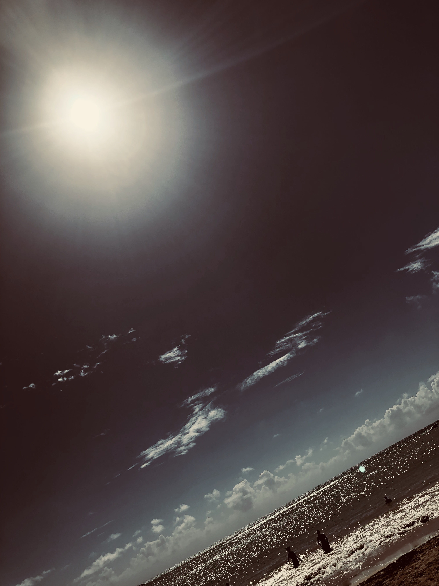

<h2 style='font-family:"SingleSleeve";font-size:48pt;text-align:center;'>Boiling</h2>
<h3>by Iris Flores</h3>
 

One day

Looking up towards the sky

It hits me

We look <em>out</em> towards the sky

Not unlike

out towards the sea

 

Across an ancient, alien medium

I witness stars — islands far away from home

The clouds roll in, high tide

I’m safe ashore, but! Passion

Don’t we all want to explore?

 

Explore my Self and what I found is nothing

An ancient, alien, empty thing

Maybe, reaching out towards the stars

I find meaning

I find life

 

But Death — our mother

Her grasp is more than strong she’s perfect

 

I find pain

I find struggle

I find all we know is only but a dream

 

But Death — She calls us down (no. <em>in</em>)

Her hand comes up (no. <em>out</em>) and pulls us

 

A tree

Grows tall

It lives

It dies

Comes back home

It melts into the ground

 

A body

Grows old

It suffers

It laughs

Shits itself before it dies

It melts into the ground

 

A person

Grows sad

They suffer

On a building or, perhaps, a bridge

(or maybe, sitting on a tub, holding in their hand a knife?)

They jump — out towards the stars

 

But Death — She calls us down (no. <em>in</em>)

Her hand comes up (no. <em>out</em>) and pulls us

 

Life, in the scope of all things true — so short

Not tall

We know how far away the stars are

Like us, lonely

Death, in the scope of all things true — alive

 

Soil

The womb of all things on this lonely rock

This boiling rock atop a furnace (a God, the Sun)

We call it Earth and we are bubbles

Sea foam blooming on this beach’s sand

